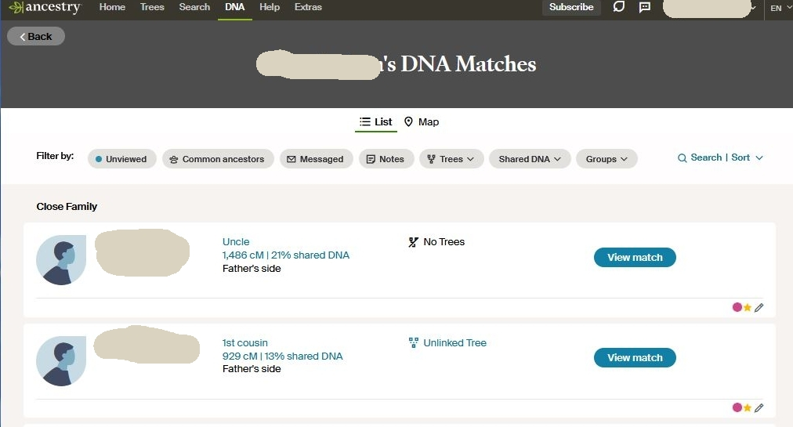
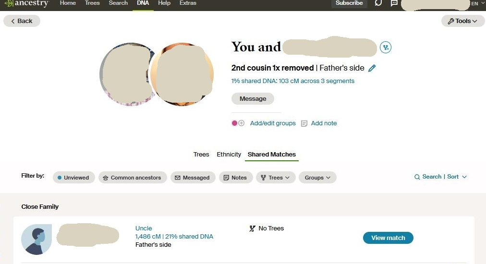

# extact-matches-to-csv

Make a comma separated values (CSV) file from the text representation of Ancestry DNA matches
from a web browser.

- Requires Python 3.6+
- Assumes input names are UTF-8

## Usage ##

From your Ancestry page displaying shared matches: scroll to the bottom of the page or as
far down as the end of interesting matches. Then from the browser File -> Save As menu, save
the output as a text file named with ".txt".

Do the same for any of the linked shared match people.

Copy this Python program into the folder containing those text files and run it by clicking on
it (in a windowing environment) or using the command line to change the options. The output
file (if default) will be created in the same folder.

Depending on the Python installation method, it may be necessary to use the command line 
to run the program like this:
``` 
python extract-matches-to-csv.py
```

Example of using the command line to change options:
```
extract-matches-to-csv.py --id-with-name --min-cm 32
```


## Options ## 

--out-file FILENAME

Output file, default "matches.csv". This option is used rather than output to stardard-out so
that a file is created without resorting to command line usage.

--min-cm CMVALUE

Default 22. Reject and natches with a cM match smaller that this value.

--skip-hesder

Do not output a header line. Default: header is included

--skip-id

Include the ids for each person as extracted from the URL for match pairs.
The ids help to uniquely identify each person. Default: ids are included.

--id-with-name

Attach a person's id to the person name. Default is to put ids in a separate column.

## Examples ##

Account owner's page:


Match to owner page:

