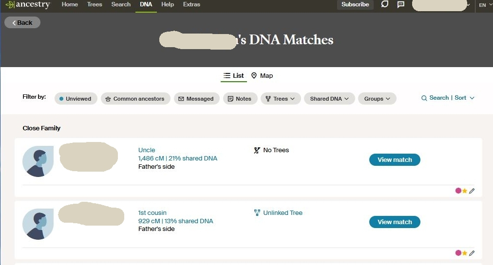
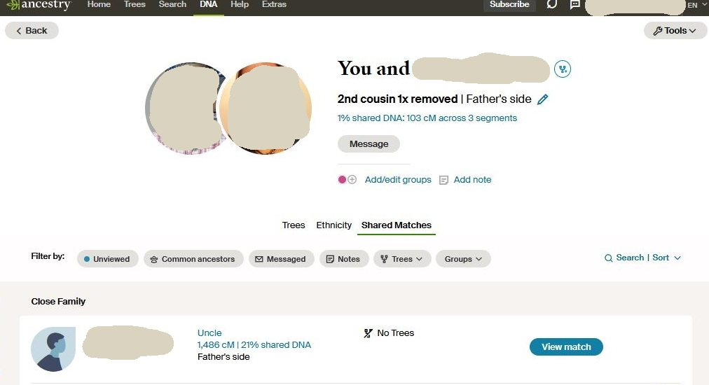

# extact-matches-to-csv

Make a comma separated values (CSV) file from the text representation of Ancestry DNA matches
from a web browser.

- Requires Python 3.6+
- Assumes input names are UTF-8

## Usage ##

From your Ancestry page displaying shared matches: scroll to the bottom of the page or as
far down as the end of interesting matches. Then from the browser use the menu File -> Save As
to save the output as a text file named with ".txt".

Do the same for any of the linked shared match people.

Copy this Python program into the folder containing those text files and run it by clicking on
it (in a windowing environment) or using the command line to change the options. The output
file (if default) will be created in the same folder.

Depending on the Python installation method, it may be necessary to use the command line 
to run the program like this:
``` 
python extract-matches-to-csv.py
dir matches.csv
```

Example of using the command line to change options:
```
extract-matches-to-csv.py --id-with-name --min-cm 32
```


## Options ## 

--out-file FILENAME

Output file, default "matches.csv". This option is used rather than output to stardard-out so
that a file is created without resorting to command line usage.

--min-cm CMVALUE

Default 22. Reject any matches with a cM match smaller than this value.

--skip-hesder

Do not output a header line. Default: header is included

--skip-id

Include the ids for each person as extracted from the URL for match pairs.
The ids help to uniquely identify each person. Default: ids are included.

--id-with-name

Attach a person's id to the person name. Default is to put ids in a separate column.

## Examples ##

Account owner's page:


Text from account owner page:

```
Skip Ancestry navigation <#skipped-nav> Main Menu Ancestry Home
<https://www.ancestry.ca/>
...

  Account owner's DNA Matches
...

    Close Family

<https://www.ancestry.ca/discoveryui-matches/compare/ID1/with/ID2>

      Match name 1
      <https://www.ancestry.ca/discoveryui-matches/compare/ID1/with/ID2>

Uncle
1,486 cM | 21% shared DNA
Father's side
No Trees
View match

Uncle
1,486 cM | 21% shared DNA

Father's side
No Trees
View match

<https://www.ancestry.ca/discoveryui-matches/compare/ID1/with/ID3>

      Another match
      <https://www.ancestry.ca/discoveryui-matches/compare/ID1/with/ID3>

1st cousin
929 cM | 13% shared DNA
Father's side
Unlinked Tree
...
```

Match to owner page:


Text from match page:

```
Skip Ancestry navigation <#skipped-nav> Main Menu Ancestry Home
<https://www.ancestry.ca/>
...

Profile photo of user Account owner.
Profile photo of user Match name 3.

  You and Match name 3
  <https://www.ancestry.ca/account/profile/id>

2nd cousin 1x removed| Father's side
1% shared DNA: 103 cM across 3 segments
Message
<https://www.ancestry.ca/messaging/?id&testguid1=ID1&testguid2=ID4>
Add/edit groups
Add note
...
    Close Family

<https://www.ancestry.ca/discoveryui-matches/compare/ID2/with/ID4>

      Match name 1
      <https://www.ancestry.ca/discoveryui-matches/compare/ID2/with/ID4>

Uncle
1,486 cM | 21% shared DNA
Father's side
No Trees
View match
```

Output using "--id-with-name" option:

```
"name 1","name 2","cM"
"Account owner/ID1","Match name 1/ID2","1486"
"Account owner/ID1","Another match/ID3","929"
"Match name 3/ID4","Match name 1/ID2","1486"
```
